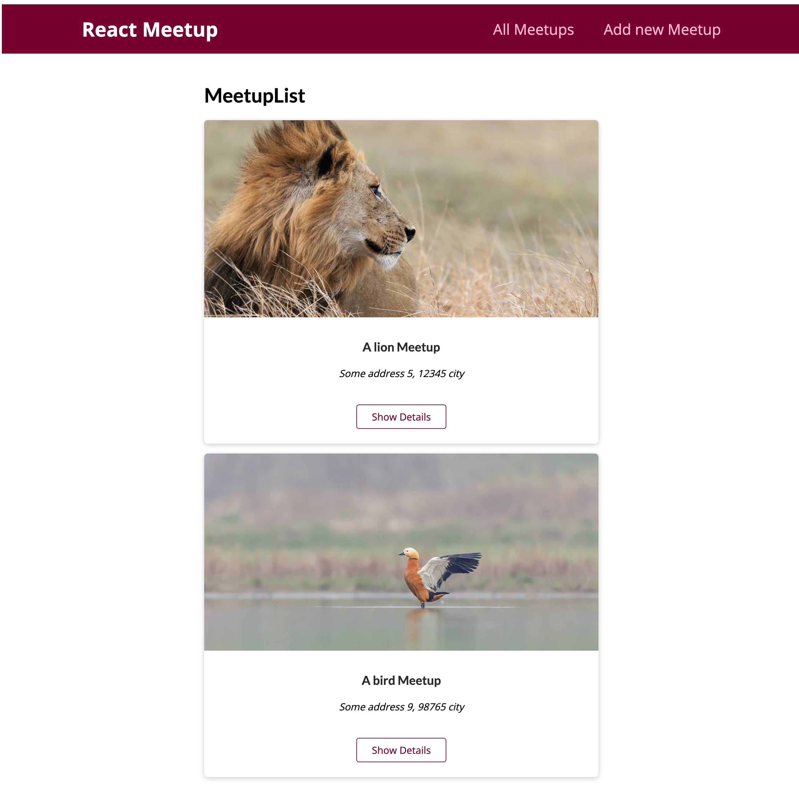
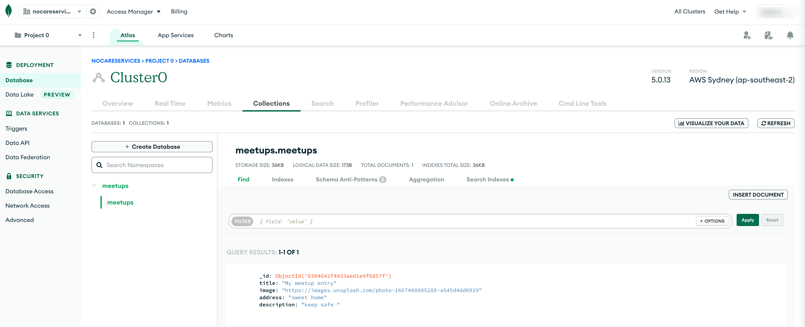

# NEXTJS-MEETUP

This is a [Next.js](https://nextjs.org/) project bootstrapped with [`create-next-app`](https://github.com/vercel/next.js/tree/canary/packages/create-next-app).

<p align="center">
  <a href="https://reactjs.org/" target="blank"></a>
  <a href="https://www.mongodb.com/atlas/database" target="blank"></a>
</p>


## Home Page



## Cloud MongoDB Collection



## Stack

* [Next 13.0.1](https://nextjs.org/) <sub><sup>[Next github examples](https://github.com/vercel/next.js/tree/canary/examples)</sub></sup>
  * Routing
  * Layout
  * CSS modules
  * Image component
  * Data Fetching
    * [getStaticProps](https://nextjs.org/docs/basic-features/data-fetching/get-static-props) <sub><sup>[[sample 1]](./pages/index.js)- [[sample 2]](./pages/meetups/[meetupId].js)</sub></sup>
      - (Static Site Generation) from a page.
      - Next.js will pre-render this page at build time using the props returned.
      - [Incremental Static Regeneration](https://nextjs.org/docs/basic-features/data-fetching/incremental-static-regeneration)
    * [getServerSideProps](https://nextjs.org/docs/basic-features/data-fetching/get-server-side-props) <sub><sup>[[sample]](./pages/index.js#21)</sub></sup>
      - (Server-Side Rendering) from a page.
      - Next.js will pre-render this page on each request using the data returned.
    * [getStaticPaths](https://nextjs.org/docs/basic-features/data-fetching/get-static-paths) <sub><sup>[[sample]](./pages/meetups/[meetupId].js)</sub></sup>
      - (Static Site Generation) from a page.
      - Dynamic Routes and uses getStaticProps, Next.js will statically pre-render all the paths specified.
  * Routing  
    * [API Routes](https://nextjs.org/docs/api-routes/introduction) - <sub><sup>[[sample]](./pages/api/meetups/add.js) - [[caller]](pages/meetups/new.js)</sub></sup>
      - Special routes/pages which don't return html code but are instead about accepting incoming http requests (post, patch, put, delete, etc) with json data attached which then do whatever you need to do.
      - Allows you to build your own api endpoints as part of this Next project (GraphQL, REST, CORS)
* [React 18.2.0](https://reactjs.org/)
  * Hooks
    * UseRouter <sub><sup>[[sample]](./components/meetups/MeetupItem.js)</sub></sup>
    * UseRef - for input form <sub><sup>[[sample]](./components/meetups/NewMeetupForm.js)</sub></sup>
    * UseEffect - for fetching data <sub><sup>[[sample]](./pages/index.js)</sub></sup>
    * UseState - to store meetups <sub><sup>[[sample]](./pages/index.js)</sub></sup>
* [Typescript 4.8.4](https://www.typescriptlang.org/)
* [Cloud MongoDB Atlas](https://www.mongodb.com/) <sub><sup>[[sample]](./pages/api/meetups/add.js)</sub></sup>
    > **_NOTE:_**  
    >  - Add your IP address to the Security > Network Access. </br>
    >  - Add an User to the Security > Database Access

## Getting Started

Creating a next js project

```bash
npx create-next-app nextjs-meetup --ts
```

### Set up a MongoDB database

Set up a MongoDB database either locally or with [MongoDB Atlas for free.](https://mongodb.com/atlas)

### Set up environment variables

Copy the env.local.example file in this directory to .env.local (which will be ignored by Git):

```bash
cp env.local.example .env.local
```

Set each variable on `.env.local`:

* `MONGODB_URI` - Your MongoDB connection string. If you are using MongoDB Atlas you can find this by clicking the "Connect" button for your cluster.

### Run Next.js in development mode

First, run the development server:

```bash
npm run dev
# or
yarn dev
```

Open [http://localhost:3000](http://localhost:3000) with your browser to see the result.

## Deploy on Vercel

The easiest way to deploy your Next.js app is to use the [Vercel Platform](https://vercel.com/new?utm_medium=default-template&filter=next.js&utm_source=create-next-app&utm_campaign=create-next-app-readme) from the creators of Next.js.

Check out our [Next.js deployment documentation](https://nextjs.org/docs/deployment) for more details.
